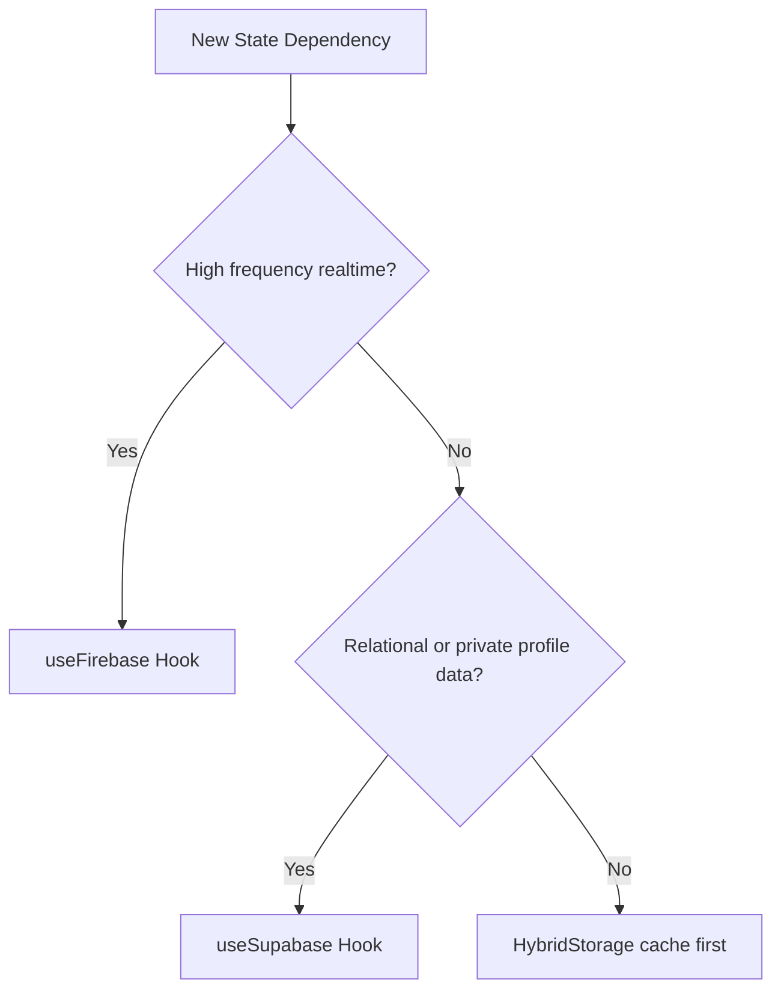

# Database Routing & Quota Optimization Strategy

PingWorld adopts a dual-database architecture using **Supabase** and **Firebase** to provide robust, real-time client utilities while protecting free-tier resource allocation limits.

---

## 📊 Database Quota Comparison

| System | Free-tier Quota limits | Primary Usage Strengths |
| :--- | :--- | :--- |
| **Supabase** | 50,000 monthly reads / 500 MB storage | Persistent relational tables, structured data models, SQL queries, user authentication & offline-first REST APIs. |
| **Firebase** | 50,000 **daily** Firestore reads / 20k writes | High-frequency message streams, low-latency live scoreboards/leaderboards, and reactive real-time sockets. |

---

## 🔀 Feature Routing Decisions

Use the guidelines below to decide whether to query with `useSupabase()` or `useFirebase()` when writing new tool modules:

### 1. `useSupabase()` Routing

- **User Accounts & Profiles** — Stored in Supabase `profiles` table to maintain relational referential integrity.
- **Persistent Quizzes** — Structured forms with question arrays, response limits, and access keys. Since quizzes are edited/run infrequently, it fits the SQL model.
- **Redirection Shortcuts** — URL shortener links are persisted in Supabase `short_links` table. Redirection visits increment counts in background threads.
- **User Notes** — Offline notes with a cloud-sync backup option are stored in Supabase `notes` table.

### 2. `useFirebase()` Routing

- **Live Tournaments & Scoreboards** — Standings that update frequently during matches require high read/write frequencies.
- **Live Quiz Session Leaderboards** — Real-time quiz competition scoreboard ranks where dozens of players answer concurrently.
- **Realtime Communication Streams** — Anonymous message replies where instantaneous message alerts are needed.

### 3. Local-First Caching fallback (`HybridStorage`)

- All tables should read/write to `localStorage` caches immediately to prevent network blocking.
- Periodic synchronizations are debounced (e.g. 1.2 seconds) to bundle multiple client inputs into single database queries.

PS C:\Users\HomePC\Desktop\pingwrld> git pull
Auto-merging src/app/(main)/api/[apiId]/page.tsx
Auto-merging src/app/(main)/api/call/[apiId]/route.ts
CONFLICT (content): Merge conflict in src/app/(main)/api/call/[apiId]/route.ts
Auto-merging src/app/(main)/quiz/page.tsx
Auto-merging src/components/dev-engines/ColorDevTool.tsx
Auto-merging src/components/quiz/PublicQuizTaker.tsx
CONFLICT (content): Merge conflict in src/components/quiz/PublicQuizTaker.tsx
Auto-merging src/lib/dev-engines/alerting-toast/index.ts
CONFLICT (content): Merge conflict in src/lib/dev-engines/alerting-toast/index.ts
Auto-merging src/lib/dev-engines/audio-editing/index.ts
CONFLICT (content): Merge conflict in src/lib/dev-engines/audio-editing/index.ts
Auto-merging src/lib/dev-engines/autocorrect/index.ts
CONFLICT (content): Merge conflict in src/lib/dev-engines/autocorrect/index.ts
Auto-merging src/lib/dev-engines/db-validation/index.ts
CONFLICT (content): Merge conflict in src/lib/dev-engines/db-validation/index.ts
Auto-merging src/lib/dev-engines/audio-editing/index.ts
CONFLICT (content): Merge conflict in src/lib/dev-engines/audio-editing/index.ts
Auto-merging src/lib/dev-engines/autocorrect/index.ts
CONFLICT (content): Merge conflict in src/lib/dev-engines/autocorrect/index.ts
Auto-merging src/lib/dev-engines/db-validation/index.ts
CONFLICT (content): Merge conflict in src/lib/dev-engines/db-validation/index.ts
Auto-merging src/lib/dev-engines/db-validation/index.ts
CONFLICT (content): Merge conflict in src/lib/dev-engines/db-validation/index.ts
Auto-merging src/lib/dev-engines/email-engine/index.ts
CONFLICT (content): Merge conflict in src/lib/dev-engines/email-engine/index.ts
Auto-merging src/lib/dev-engines/image-editing/index.ts
CONFLICT (content): Merge conflict in src/lib/dev-engines/image-editing/index.ts
Auto-merging src/lib/dev-engines/tone-correction/index.ts
CONFLICT (content): Merge conflict in src/lib/dev-engines/tone-correction/index.ts
Automatic merge failed; fix conflicts and then commit the result.
PS C:\Users\HomePC\Desktop\pingwrld>